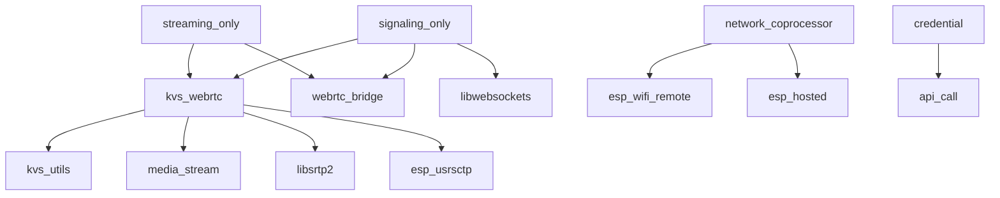

# 🧩 ESP-IDF Components for WebRTC

This directory contains the complete ecosystem of ESP-IDF components needed for Amazon KVS WebRTC functionality on ESP32 devices. Each component is modular and can be used independently or as part of the complete WebRTC solution.

## 🏗️ Component Architecture

### Core WebRTC Components
| Component | Purpose | Dependencies | Use Case |
|-----------|---------|--------------|----------|
| **[kvs_webrtc](kvs_webrtc/)** | Main WebRTC application logic | kvs_utils, media_stream | Core WebRTC functionality |
| **[kvs_utils](kvs_utils/)** | KVS SDK utilities and helpers | - | AWS KVS integration |
| **[media_stream](media_stream/)** | Audio/video capture interface | - | Hardware abstraction |

### Signaling & Communication
| Component | Purpose | Dependencies | Use Case |
|-----------|---------|--------------|----------|
| **[signaling_serializer](signaling_serializer/)** | Message serialization | - | Custom signaling protocols |
| **[webrtc_bridge](webrtc_bridge/)** | Bridge communication protocol | - | Split mode IPC |
| **[network_coprocessor](network_coprocessor/)** | Network processor utilities | esp_wifi_remote | Dual-chip networking |

### Network & Protocol Stack
| Component | Purpose | Dependencies | Use Case |
|-----------|---------|--------------|----------|
| **[libwebsockets](libwebsockets/)** | WebSocket client/server | - | Signaling connections |
| **[libsrtp2](libsrtp2/)** | Secure RTP implementation | - | Media encryption |
| **[esp_usrsctp](esp_usrsctp/)** | SCTP protocol for ESP | - | Data channels |
| **[libllhttp](libllhttp/)** | HTTP parsing library | - | HTTP connections |

### Hardware & Platform Support
| Component | Purpose | Dependencies | Use Case |
|-----------|---------|--------------|----------|
| **[esp_wifi_remote](esp_wifi_remote/)** | Remote Wi-Fi functionality | - | Network coprocessor |
| **[esp_hosted](esp_hosted/)** | ESP-Hosted functionality | - | Dual-chip communication |
| **[esp32_p4_function_ev_board](esp32_p4_function_ev_board/)** | P4 board support | - | Hardware-specific features |
| **[esp_webrtc_utils](esp_webrtc_utils/)** | WebRTC utilities for ESP | - | Platform optimizations |

### Development & API Components
| Component | Purpose | Dependencies | Use Case |
|-----------|---------|--------------|----------|
| **[api_call](api_call/)** | API call handling | - | Remote procedure calls |
| **[credential](credential/)** | Credential management | - | AWS authentication |
| **[state_machine](state_machine/)** | State machine utilities | - | Application logic |

## 🚀 Quick Integration

### Using in Your ESP-IDF Project

**Option 1: Use Specific Components (Recommended)**
```yaml
# In your project's idf_component.yml
dependencies:
  kvs_webrtc:
    path: path/to/esp_port/components/kvs_webrtc
  media_stream:
    path: path/to/esp_port/components/media_stream
```

**Option 2: Add All Components**
```cmake
# In your project's CMakeLists.txt
set(EXTRA_COMPONENT_DIRS "path/to/esp_port/components")
```

**Option 3: Component Registry (Future)**
```yaml
# When available on ESP Component Registry
dependencies:
  espressif/esp_webrtc: "^1.0.0"
```

## 📋 Component Details

### 🎯 Core Components

#### kvs_webrtc
- **Purpose**: Main WebRTC application framework
- **Key APIs**: `app_webrtc_init()`, `app_webrtc_run()`, `webrtcAppCleanup()`
- **Features**: Complete WebRTC stack, AWS KVS integration, media management
- **Memory**: ~200KB Flash, ~150KB RAM

#### media_stream
- **Purpose**: Hardware abstraction for audio/video
- **Key APIs**: Video capture, audio capture, codec interfaces
- **Features**: Camera drivers, microphone interfaces, codec management
- **Supported Hardware**: ESP32-CAM, ESP32-S3-EYE, ESP32-P4 cameras

#### kvs_utils
- **Purpose**: AWS KVS SDK utilities
- **Key APIs**: KVS client, credential management, logging
- **Features**: AWS authentication, KVS signaling client, error handling
- **Dependencies**: AWS C SDK components

### 🌐 Network Components

#### libwebsockets
- **Purpose**: WebSocket client/server implementation
- **Features**: Secure WebSockets, HTTP client/server, extensive protocol support
- **Use Cases**: Custom signaling servers, AppRTC integration, web interfaces
- **Memory**: ~80KB Flash, ~20KB RAM

#### libsrtp2
- **Purpose**: Secure Real-time Transport Protocol
- **Features**: RTP/RTCP encryption, AES encryption, authentication
- **Use Cases**: Secure media streaming, WebRTC encryption
- **Standards**: RFC 3711, RFC 6904

### 🔗 Communication Components

#### webrtc_bridge
- **Purpose**: Inter-processor communication for split mode
- **Key APIs**: Bridge protocol, message passing, state synchronization
- **Features**: Reliable IPC, automatic reconnection, protocol versioning
- **Use Cases**: ESP32-P4 + ESP32-C6 communication

#### signaling_serializer
- **Purpose**: Message serialization for custom signaling
- **Features**: JSON serialization, binary protocols, message validation
- **Use Cases**: Custom signaling implementations, protocol adapters

## 🛠️ Development Guide

### Adding New Components

**1. Create Component Structure**
```bash
mkdir components/my_component
cd components/my_component
touch CMakeLists.txt idf_component.yml
mkdir include src
```

**2. Basic CMakeLists.txt**
```cmake
idf_component_register(
    SRCS "src/my_component.c"
    INCLUDE_DIRS "include"
    REQUIRES kvs_utils
)
```

**3. Component Dependencies**
```yaml
# idf_component.yml
version: "1.0.0"
description: My WebRTC component
dependencies:
  idf: ">=5.0"
  kvs_utils: "*"
```

### Component Testing

**Unit Tests**
```bash
cd components/my_component/test
idf.py -C . build flash monitor
```

**Integration Tests**
```bash
# Use examples as integration tests
cd examples/webrtc_classic
idf.py build flash monitor
```

## 📊 Component Dependencies



## 🚨 Troubleshooting Components

### Common Issues

| Issue | Component | Solution |
|-------|-----------|----------|
| **Build Errors** | Any | Check dependencies in `idf_component.yml` |
| **Link Errors** | libsrtp2, libwebsockets | Ensure components are in `EXTRA_COMPONENT_DIRS` |
| **Runtime Crashes** | kvs_webrtc | Check stack size and heap allocation |
| **Memory Issues** | media_stream | Enable PSRAM, optimize buffer sizes |

### Debug Tools

**Component Memory Usage**
```bash
idf.py size-components
```

**Dependency Analysis**
```bash
idf.py show_efuse_table
```

## 📚 Additional Resources

- 📖 **[API_USAGE.md](../API_USAGE.md)** - Complete API documentation
- 📖 **[CUSTOM_SIGNALING.md](../CUSTOM_SIGNALING.md)** - Custom component development
- 🔧 **[ESP-IDF Component Guide](https://docs.espressif.com/projects/esp-idf/en/latest/esp32/api-guides/build-system.html#component-requirements)**
- 🌐 **[ESP Component Registry](https://components.espressif.com/)**

## 🤝 Contributing

### Adding New Components
1. Follow ESP-IDF component structure
2. Add comprehensive documentation
3. Include unit tests
4. Update this README with component info

### Component Standards
- **Naming**: Use snake_case for directories
- **APIs**: Follow ESP-IDF conventions
- **Documentation**: Include README.md in each component
- **Testing**: Add test apps for complex components

---

**Origin**: Some components are ported from [Amazon Kinesis Video Streams PIC](https://github.com/awslabs/amazon-kinesis-video-streams-pic) and adapted for ESP32 platform.
